<div align="center">
  
  <br><br>
  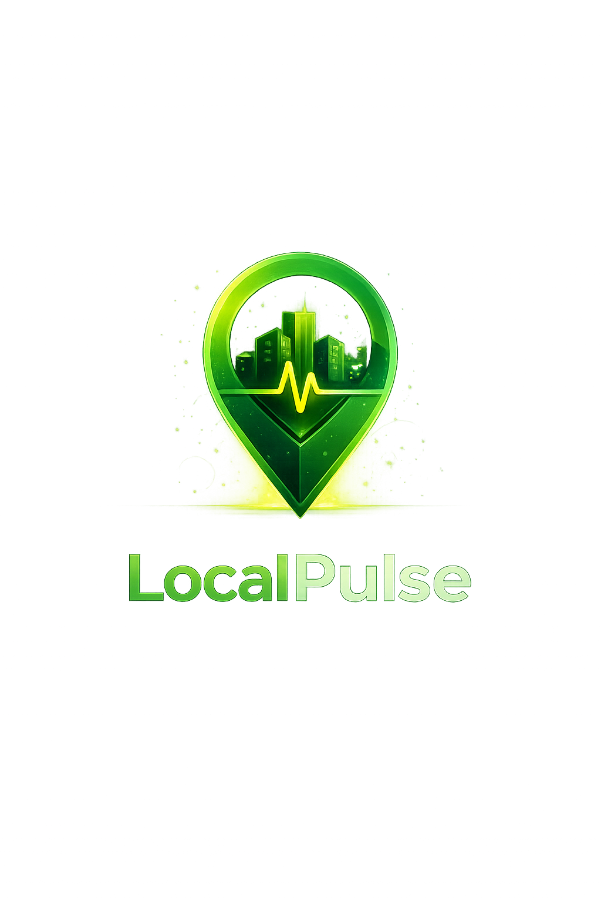
  
  # LocalPulse
  **Your Neighbourhood, Connected.**
  
  [](https://reactnative.dev/)
  [](https://expo.dev/)
  [](https://supabase.com/)
  [](https://deepmind.google/technologies/gemini/)

  *A next-generation civic engagement platform that empowers citizens to report, track, and resolve local issues in real-time, powered by AI and Gamification.*
</div>

---

## 🚨 The Problem

Modern cities face a severe disconnect between citizens and local authorities. When a civic issue occurs—such as a broken water pipe, an open manhole, or a power outage—citizens struggle with:
- **Fragmented Reporting:** Unclear channels on exactly who to contact.
- **Lack of Transparency:** No way to track if an issue is being seen or resolved.
- **Duplicate Complaints:** Authorities are flooded with redundant reports for the exact same issue.
- **Apathy:** Citizens feel their voice doesn't matter, leading to the "bystander effect" where no one reports critical infrastructure damage.

## 💡 Our Solution: LocalPulse
LocalPulse bridges the gap by turning civic reporting into a seamless, intelligent, and rewarding community experience. 

By leveraging **Google Gemini AI** and **Real-Time Geospatial Tracking**, citizens can simply snap a photo of a problem. The AI automatically classifies the issue, assesses its severity, and broadcasts it to the entire neighbourhood. LocalPulse prevents duplicate reports through intelligent clustering and incentivizes community participation through a robust gamification system.

---

<h2 align="center">✨ Live App Gallery</h2>

<p align="center">
  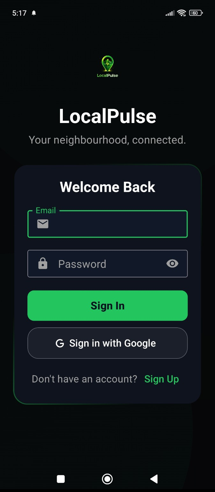
  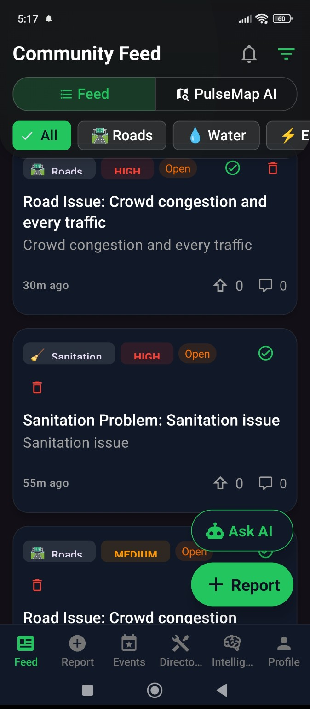
  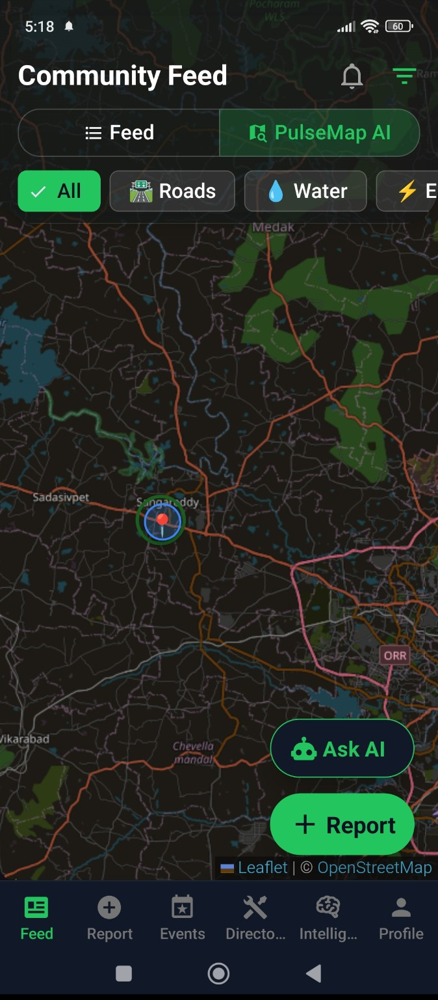
</p>
<p align="center">
  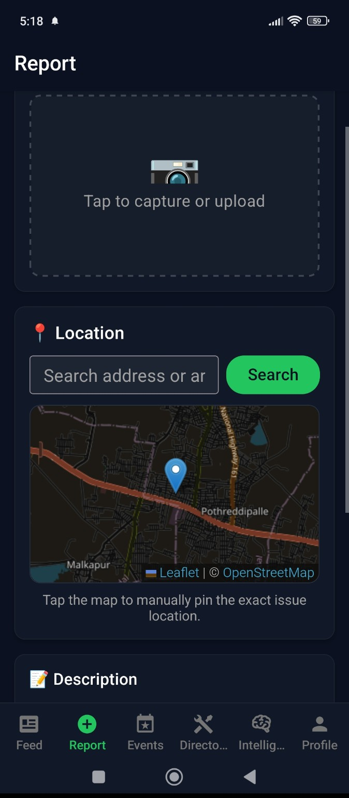
  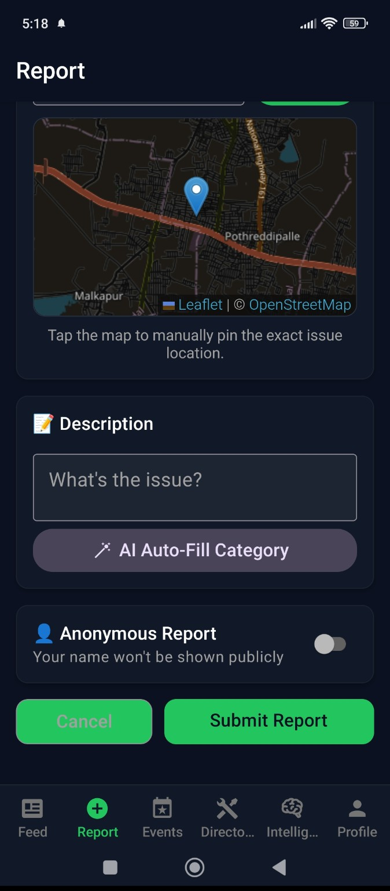
  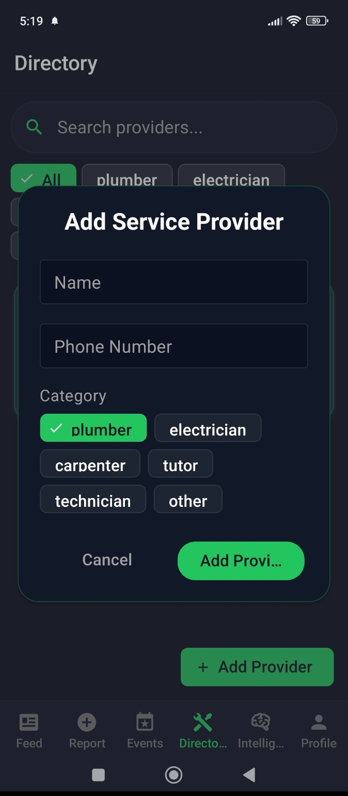
</p>
<p align="center">
  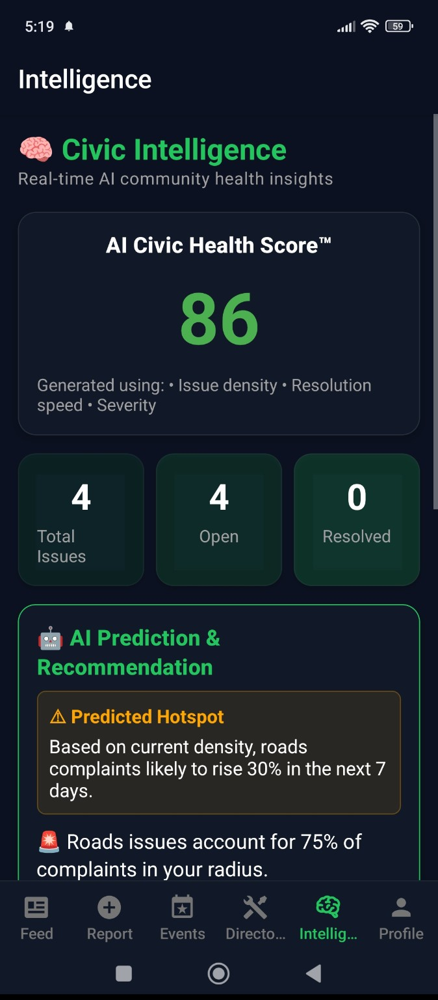
  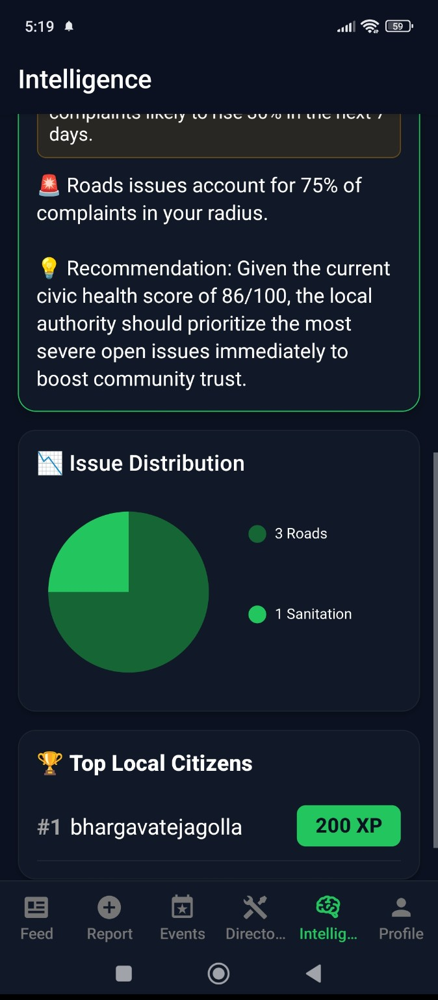
  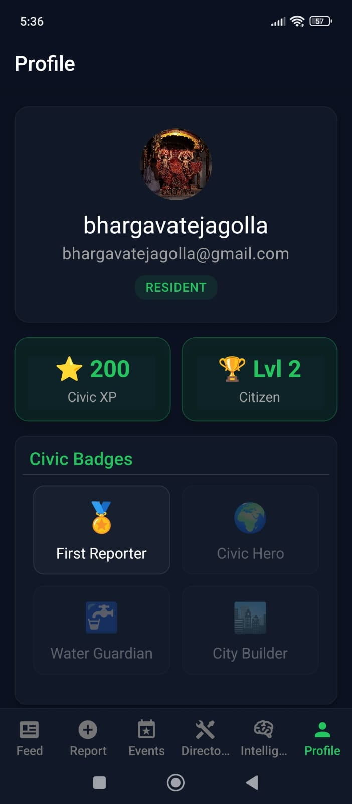
</p>

---

## 🔍 In-Depth Clarity: Core Features

### 📸 AI Auto-Classification & Triage
We integrated **Google Gemini Pro Vision** to remove the friction of reporting. Users simply upload a photo, and the AI analyzes the visual damage to:
- Automatically assign the correct category (e.g., Roads, Electricity, Sanitation).
- Determine the exact severity level (Low, Medium, High, Critical).
- Provide a clear, structured summary of the problem.

### 📍 Precision Geospatial Tracking & Heatmaps
Built on lightweight **OpenStreetMap** architecture, LocalPulse features a zero-lag interactive map. 
- **Radius Tracking:** Users only see issues strictly within their geographic radius, eliminating noise.
- **Live Heatmaps:** Visual cluster mapping instantly highlights severely degraded zones in the city.

### 🔔 Global Real-Time Notification Engine
When a high-severity issue is logged, our **Supabase Postgres logical replication** instantly triggers a global push notification. Every user in the radius receives a sliding modal alert and audio chime the exact second the issue is created—zero polling required.

### 🎮 Civic Gamification
We destroy the "bystander effect" through positive reinforcement. Users earn **Civic Points (XP)** for reporting issues, verifying others' reports, and contributing to resolutions. The real-time Leaderboard crowns the top civic heroes in the city.

### 🛡️ Intelligent Duplicate Prevention
Before an issue is submitted, the system cross-references GPS coordinates and AI embeddings against active complaints. If an identical issue exists nearby, the user is prompted to "Upvote" the existing issue rather than flooding the database with duplicates.

---

## 🚀 Extreme Scalability & Architecture


LocalPulse is not just a prototype; it is engineered for production-level municipal scaling.

### 1. The Stack
- **Frontend:** React Native (Expo) ensures true cross-platform native compilation (iOS & Android) from a single, deeply modularized TypeScript codebase.
- **Backend:** Supabase (PostgreSQL) powers the platform. We utilize raw SQL RPC functions (`ST_DWithin`) combined with PostGIS for hyper-fast radius queries across massive datasets.

### 2. Why it Scales
- **Edge Computing & Caching:** We utilize aggressive asynchronous storage caching on the device. Data is only fetched when the user's geographic sector changes.
- **WebSockets over REST:** Instead of heavy REST polling that crashes servers, LocalPulse maintains a lightweight WebSocket connection directly to Postgres. Changes to the database are streamed instantly to the client.
- **Row Level Security (RLS):** Every single database request is cryptographically verified at the database level, ensuring user data is completely siloed and secure without requiring a middle-tier validation server.

### 3. Data Flow
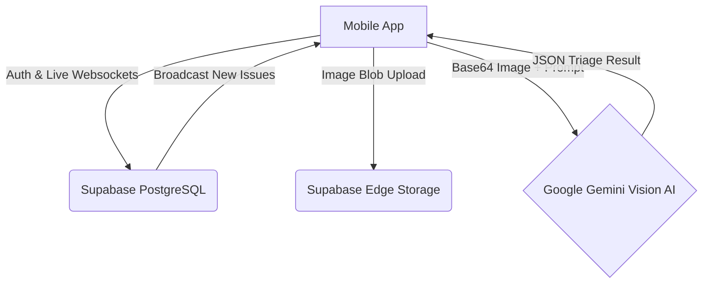

---

## 💻 Getting Started


### Prerequisites
- Node.js (v18+)
- Expo Go App on your mobile device
- A Supabase Project

### Installation
1. **Clone the repository**
   ```bash
   git clone https://github.com/bhargavatejagolla/localpulse.git
   cd localpulse
   ```

2. **Setup the Database**
   Navigate to the `supabase/` directory and run the provided `.sql` migration files in your Supabase SQL Editor to generate the tables, PostGIS extensions, and the `issue-images` public storage bucket.

3. **Configure Environment Variables**
   Inside the `mobile/` directory, create a `.env` file:
   ```env
   EXPO_PUBLIC_SUPABASE_URL=your_supabase_url
   EXPO_PUBLIC_SUPABASE_ANON_KEY=your_supabase_anon_key
   EXPO_PUBLIC_GEMINI_API_KEY=your_gemini_api_key
   ```

4. **Run the App**
   ```bash
   cd mobile
   npm install
   npx expo start
   ```

---

## 🙏 Acknowledgements

Built with ❤️ by **Team Quantum Quotients** for **DevFusion 3.O | The Developers Hackathon**.

We would like to extend our deepest gratitude to the **Indian Institute of Technology (IIT), Bombay** and the hackathon organizers for providing us with this amazing opportunity to build and showcase LocalPulse.
