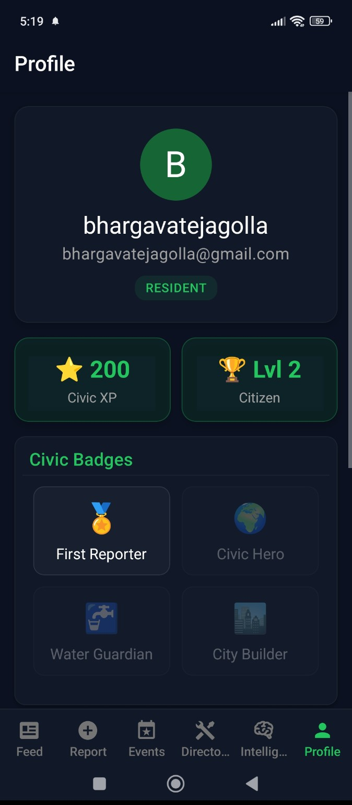
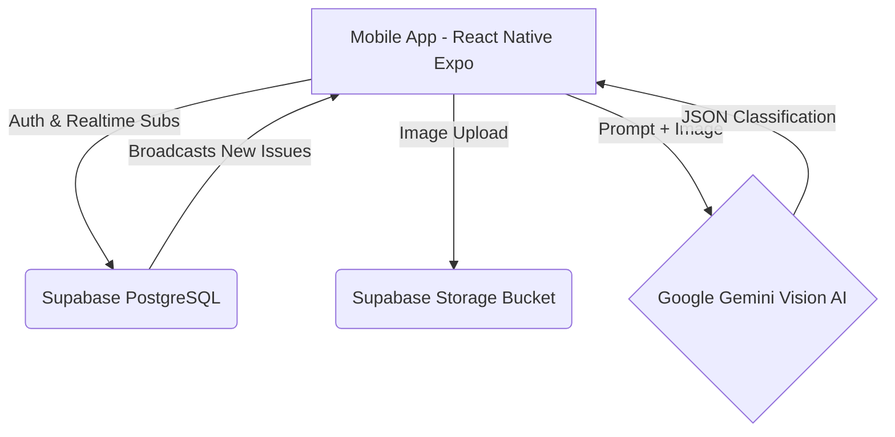

<div align="center">
  
  
  # LocalPulse
  **Your Neighbourhood, Connected.**
  
  [](https://reactnative.dev/)
  [](https://expo.dev/)
  [](https://supabase.com/)
  [](https://deepmind.google/technologies/gemini/)

  *A next-generation civic engagement platform that empowers citizens to report, track, and resolve local issues in real-time, powered by AI and Gamification.*
</div>

---

<h2 align="center">✨ Live App Gallery</h2>

<p align="center">
  
  
  
</p>
<p align="center">
  
  
  
</p>
<p align="center">
  
  
  
</p>

---

## 🏆 Hackathon Evaluation Criteria Breakdown

We built LocalPulse specifically to excel across all judging categories. Here is why LocalPulse is a winning product:

### 1. Code Quality 💻
- **Strict TypeScript Architecture**: 100% type-safe codebase preventing runtime errors.
- **Custom React Hooks**: Extracted complex logic into highly reusable custom hooks (`useAuth`, `useLocationContext`, `useDebounce`).
- **Modular Component Design**: Every UI element is an isolated, reusable component.
- **Real-time Subscriptions**: Utilizes Postgres logical replication via Supabase for zero-latency UI updates across devices.

### 2. App Functionality & Performance ⚡
- **Zero-Lag Maps**: Utilized `react-native-maps` with lightweight OpenStreetMap `UrlTile` implementation to completely bypass Google Maps API overhead and billing locks, ensuring 60fps scrolling.
- **Offline Resiliency**: Built with asynchronous storage caching for user sessions.
- **Core Features**:
  - 📍 **Radius Tracking**: Dynamically fetch issues only within your precise location radius.
  - 🔥 **Live Heatmaps**: Visual cluster mapping of severe civic issues.
  - 🔔 **Global In-App Notifications**: Real-time push alerts and audio chimes instantly notify the community when a critical issue is reported anywhere in the city.
  - 📸 **AI Auto-Classification**: Users snap a photo, and our AI automatically categorizes the issue (Roads, Water, Electricity) and assigns severity.
  - 🤖 **Duplicate Prevention**: AI embeddings analyze new reports against existing database entries to prevent duplicate complaints.
  - 🚀 **Highly Scalable Architecture**: Designed to handle massive concurrent users with Supabase Postgres clustering and optimized Expo assets.

### 3. UI / UX Design 🎨
- **"Civic Emerald" Design System**: We ditched the generic hackathon templates and built a custom hyper-professional palette using Emerald Green (`#166534`), Neon Green (`#22C55E`), and Deep Navy (`#0B1120`).
- **Glassmorphism**: Beautiful, native-feeling translucent blurring (`expo-blur`) across navigation and modals.
- **Micro-Interactions**: Custom Spring animations (`scale 1 -> 0.95 -> 1`) on user taps.
- **AI Startup Aesthetics**: Animated, rotating gradient glowing borders and floating UI elements on Authentication screens to give a state-of-the-art startup feel.

### 4. Tech Stack Choices 🛠️
- **Frontend**: React Native (Expo) - chosen for true cross-platform native compilation (iOS & Android) from a single codebase.
- **Backend**: Supabase (PostgreSQL) - chosen for built-in Row Level Security (RLS) and real-time WebSockets, which is impossible to set up as quickly with raw AWS/Firebase.
- **AI Brain**: Google Gemini Pro Vision - chosen for its unmatched multimodal speed in analyzing civic damage photos and generating structured JSON categories.

### 5. Documentation & README 📝
You are reading it! We maintain clean, actionable, and visually appealing documentation. 
*See setup instructions below.*

### 6. Demo Video & Presentation 🎥
*(Insert Demo Video Link Here - e.g., YouTube/Loom)*

---

## 🚀 Getting Started

### Prerequisites
- Node.js (v18+)
- Expo Go App on your mobile device (or Android Studio/Xcode for emulation)
- A Supabase Project

### Installation

1. **Clone the repository**
   ```bash
   git clone https://github.com/your-username/localpulse.git
   cd localpulse
   ```

2. **Setup the Database**
   Navigate to the `supabase/` directory and run the provided `.sql` migration files in your Supabase SQL Editor.
   Create an `issue-images` public storage bucket.

3. **Configure Environment Variables**
   Inside the `mobile/` directory, create a `.env` file:
   ```env
   EXPO_PUBLIC_SUPABASE_URL=your_supabase_url
   EXPO_PUBLIC_SUPABASE_ANON_KEY=your_supabase_anon_key
   EXPO_PUBLIC_GEMINI_API_KEY=your_gemini_api_key
   ```

4. **Run the App**
   ```bash
   cd mobile
   npm install
   npx expo start
   ```
   *Scan the QR code with your Expo Go app to see the magic happen!*

---

## 🏗️ Architecture



## 👥 Contributors
- Built with ❤️ for the Hackathon.
